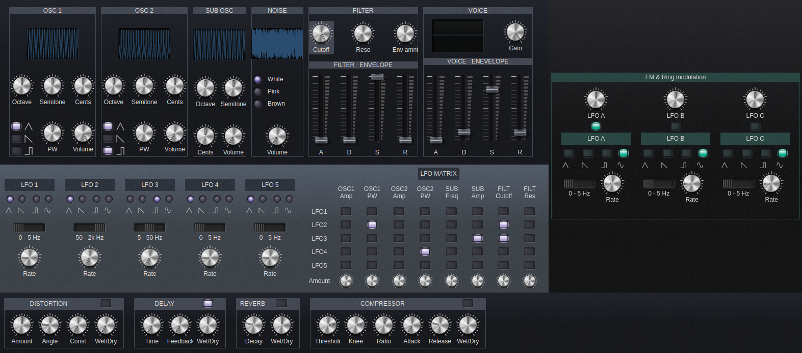

# Vintage analog web synth

#### Online Demo: [netlify-page](https://vintage-analog-web-synth.netlify.app/) hosted for free on Netlify
#### Description:
This is a TypeScript, Svelte and Web Audio API virtual analog subtractive synthesizer.

This synthesizer has the folowing features:
* 2 general purpose oscillators, inspired mostly be 80's synthesizers, with the folowing features:
  * 3 shapes that can be combined togheter: triangle, sawtooth, pulse
  * independent frequency settings for octaves, semitones and cents shift
  * variable (and modulatable) pulse width for the pulse shape
* a noise oscillator: white, pink or brown noise
* a sine sub-oscillator, that overpasses the filter, with independent frequency settings for octaves, semitones and cents shift
* a low pass filter with cutoff frequency and resonance
* one ADSR envelope for the volume/amplitude
* another ADSR envelope for filter cutoff frequency (works, but change is not very noticeable, still needs tweeking)
* 5 LFOs with the folowing features:
  * 4 shapes: triangle, sawtooth, pulse, sine
  * 3 frequency ranges: 0 - 5 Hz, 5 - 50 Hz, 50 - 2000 Hz
* an "LFO Matrix" which allows mixing all the 5 LFOs togheter and modulate various synth parameters
  * for each modulatable parameter, we can mix the 5 LFOs to obtain the final LFO that modulates that parameter
  * each modulatable parameter has it's own independent modulation amount (wich can be positive or negative)
* effects: distortion, delay, reverb, compressor
* currently only monophonic, polyphony will be added soon

### Compatibility
Unfortunately, this web synthesizer does not work perfectly on Firefox, so if you see issues on Firefox, it's normal.
The reason for this incompatibility is that, unfortunately, Firefox is missing some essential JavaScript Web Audio API functions, including:
- [cancelAndHoldAtTime()](https://developer.mozilla.org/en-US/docs/Web/API/AudioParam/cancelAndHoldAtTime), which is necessary for making good ADSR envelopes

Nevertheless, Firefox still remains my favorite browser and I hope these issues will be fixed soon.
This web synth has been tested on Google Chrome and it works as expected.

### License
The source code is licensed under the MIT license.

The images that I made myself are licensed under Creative Commons CC0.

The rest of the images/fonts are free images/fonts from the internet and they have their own license. 